# ZLMediakit + WVP_PRO平台搭建（基于Windows）
## 一、ZLMediakit环境搭建
*****
### 1、获取代码
首先新建一个文件夹用于存放ZLMediakit源码，该文件夹最好*不要出现中文*，避免后续出现bug。    


其次**请不要使用github 下载zip包的方式下载源码**，务必使用git克隆ZLMediaKit的代码，因为ZLMediaKit依赖于第三方代码，zip包不会下载第三方依赖源码，你可以这样操作：
```text
#国内用户推荐从同步镜像网站gitee下载
#打开上一步新建的文件夹，右键选择‘git bash here'
git clone --depth 1 https://gitee.com/xia-chu/ZLMediaKit
cd ZLMediaKit

#千万不要忘记执行这句命令
git submodule update --init
```
*****

### 2、编译器
***VS2017版本及以上***！！  
如果VS版本较低，需要安装cmake，详情参考[其他编译方法](https://github.com/ZLMediaKit/ZLMediaKit/wiki/%E5%BF%AB%E9%80%9F%E5%BC%80%E5%A7%8B)  
*****

### 3、依赖库安装
#### 3.1、依赖库列表
- **openssl** : windows环境下一定需要安装此依赖库，同时ZLMediaKit的https/rtsps/webrtc相关功能需要使用openssl才能开启。
  
- ffmpeg : zlmediakit可以通过fork ffmpeg进程的方式实现多种协议的拉流，编译时**不需要安装**FFmpeg。

- sdl、avcodec、avutil : 这3个库供ZLMediaKit的test_player测试程序使用，你通常**不需要安装**这3个库。


#### 3.2、openssl安装
详情安装方法网上有很多，随便一个都行。  
**不过注意**：如果机器曾经安装过linux等，可能已经下载过openssl，如果需要
安装新的版本openssl，需要将新版本的openssl添加到***系统环境变量第一个***，
这样系统会第一个读取新版本的openssl。
*****

### 4、构建和编译项目(windows + vs2017)
由于开启webrtc相关功能比较复杂，默认是不开启编译的，如果你对zlmediakit的webrtc功能比较感兴趣，可以参考
[这里](https://github.com/ZLMediaKit/ZLMediaKit/wiki/zlm%E5%90%AF%E7%94%A8webrtc%E7%BC%96%E8%AF%91%E6%8C%87%E5%8D%97)
- 可以直接在vs2017中打开项目文件夹
    ```text
    [文件] -> [打开] -> [文件夹] -> [选择ZLMediaKit代码根目录并打开]
    ```
    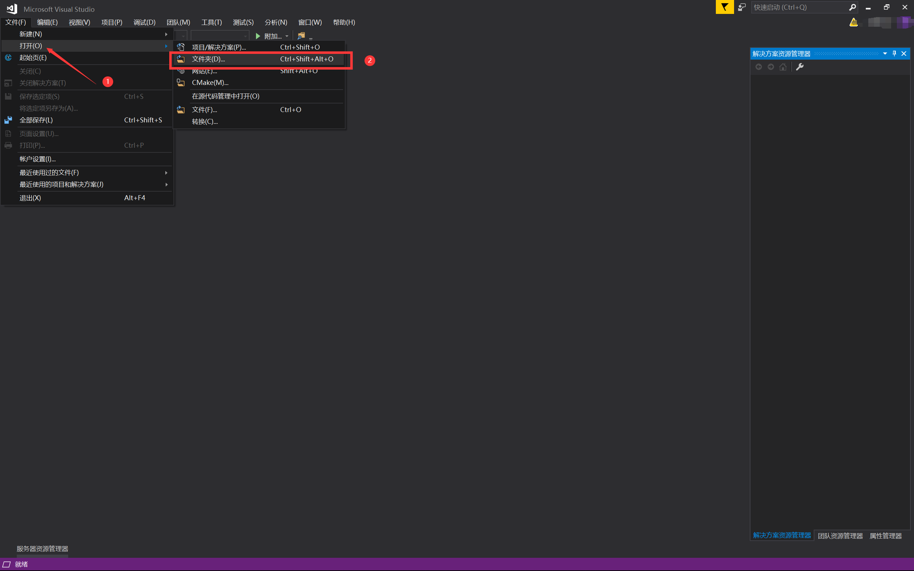   


- 打开项目后，点击项目栏“CMake”，然后点击全部生成，之后等待vs编译完代码
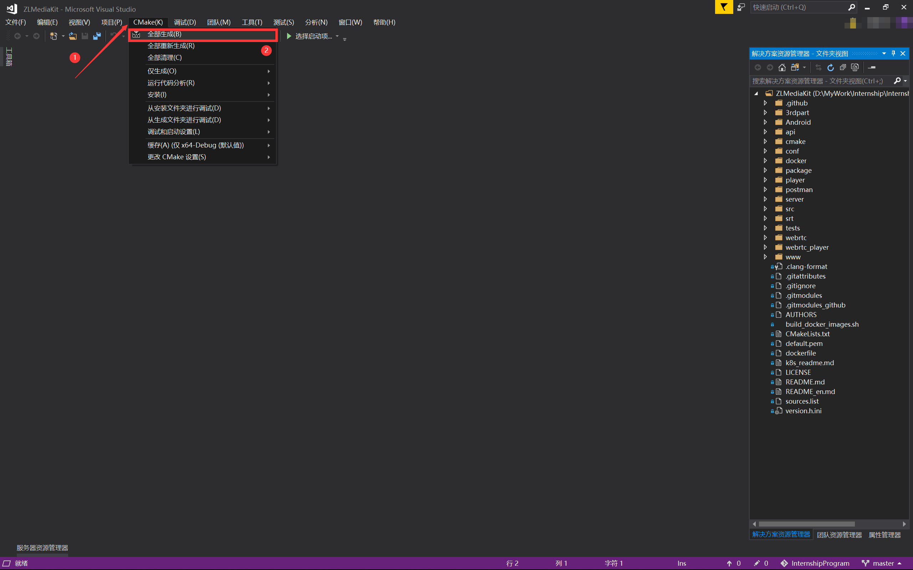


在全部编译完成后，在ZLMediakit根目录下会生成一个‘**release/windows/Debug/**’文件夹
***   

### 5、运行ZLMediakit
ZLMediaKit工程主要生成3种二进制目标文件，他们的生成的路径在release目录下，这些目标文件主要分为：
- MediaServer进程  
  这是ZLMediaKit作为服务器的*主进程*，该进程可以在免去开发的情况下直接作为测试流媒体服务器使用  
  双击release/windows/Debug/目录下的**MediaServer.exe**文件即可启动：
  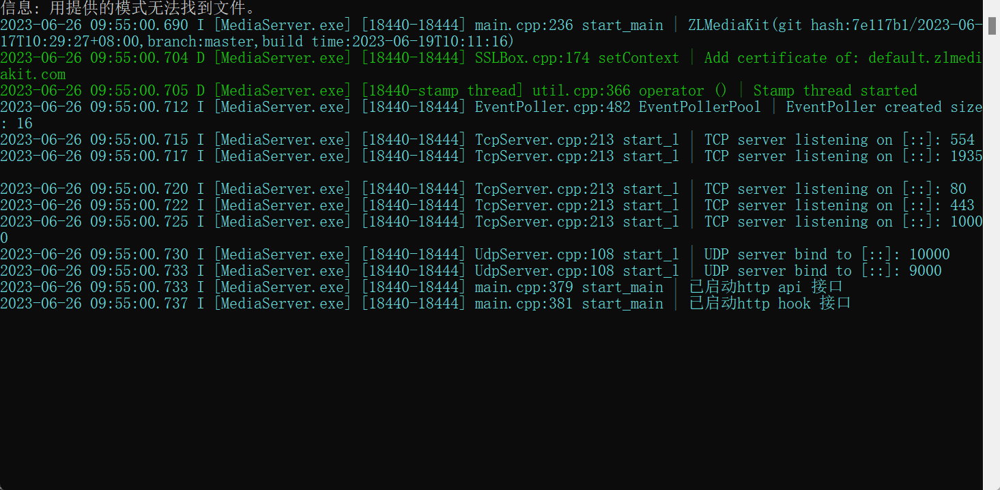
  打开浏览器，在浏览器中输入127.0.0.1可以看到启动成功：
  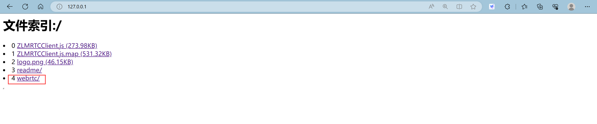  


- c api 的SDK:
  ZLMediaKit也提供c的api二次开发sdk库，头文件在ZLMediaKit/api/include,库文件为：  
  ```text
  ZLMediaKit/release/windows/Debug/mk_api.dll
  ZLMediaKit/release/windows/Debug/mk_api.lib
  ```  
   
- 以```test_开头```的测试程序:  
  相关代码在```ZLMediaKit/tests```目录下，你可以对照代码启动测试进程。  

  


## 二、WVP_Pro搭建
****  
### 1、安装依赖
- jdk >=  1.8  
- maven >= 3.3
***

### 2、下载以及编译WVP Pro代码
#### 2.1、从gitee或者github上下载代码
新建一个文件夹用于保存代码，文件夹名称最好**不要出现中文**，打开新建的文件夹，输入以下git指令：
```text
# 从gitee克隆：
git clone https://gitee.com/pan648540858/wvp-GB28181-pro.git

# 从github克隆：
git clone https://github.com/648540858/wvp-GB28181-pro.git
```    

#### 2.2、编译前端界面
上一步下载好的代码中已经*集成了前端界面*，在wvp-GB28181-pro\web_src中，打开该文件夹，在该文件夹下面打开命令行（cmd）：
```text
npm --registry=https://registry.npmmirror.com install
npm run build
```  
编译前端界面成功会在src/main/resources下出现**static目录**，同时命令行会如下图所示：
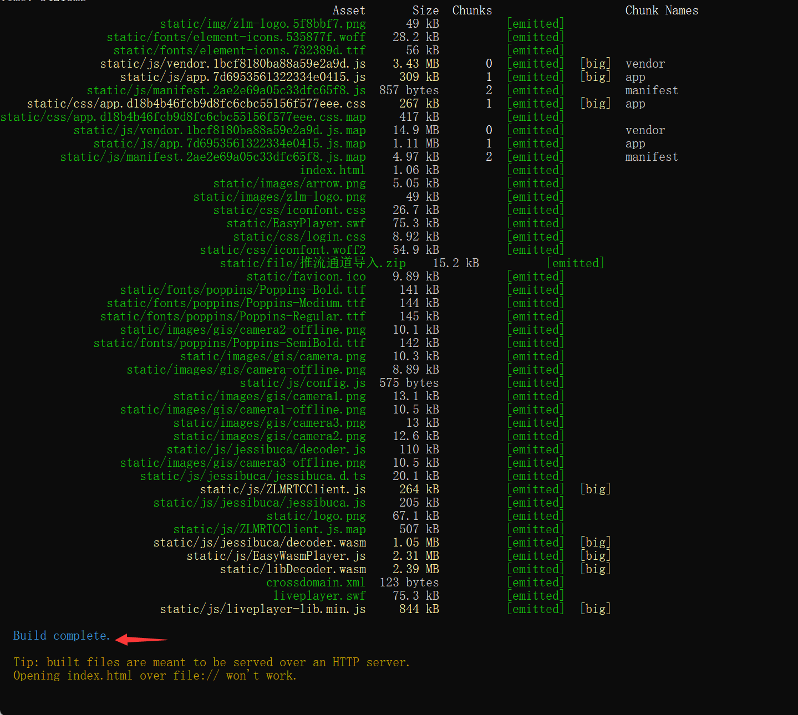

#### 2.3、生成可执行jar和生成war
在wvp pro项目**根目录**下面打开命令行，输入以下指令：
```text
# 生成可执行jar包
mvn package

# 生成war
mvn package -P war
```
编译完成后在**target目录**下出现*wvp-pro-.jar / wvp-pro-.war*。
***

### 3、WVP配置文件位置

#### 3.1 默认加载配置文件方式
使用maven打包后的jar包里，已经存在了配置文件，但是每次打开jar包修改配置文件或者修改后再打包都是比较麻烦的，所以大家可通过指定配置文件路径来加载指定位置的配置文件。
打开wvp-GB28181-pro/target目录，在该目录下打开命令行：
```text
# 下面代码中*需要替换成target目录下面对应的版本
# 比如wvp-pro-*.jar需要换成wvp-pro-2.6.9-06160319.jar
java -jar wvp-pro-*.jar --spring.config.location=../src/main/resources/application.yml
```
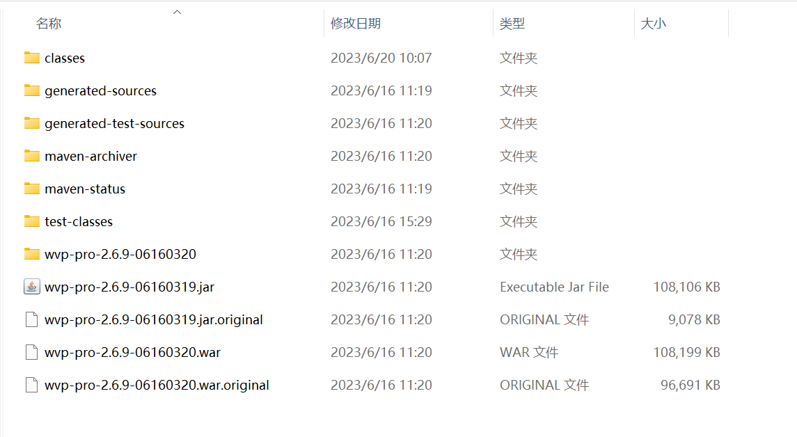  

#### 3.2 迁移配置文件以方便启动
由于配置文件的命令比较长，所以为了启动方便通常我会把**配置文件放到jar包的同级目录**，类似这样, 移除jar包内/BOOT-INF/classes/下所有以application开头的文件，使用解压缩工具打开jar即可，不需要解压出来。   
打开target目录，并在目录下打开命令行：
```text
mvn ../src/main/resources/application-dev.yml application.yml 

# 同上步骤一样需要将*替换掉
java -jar wvp-pro-*.jar
```
****

### 4、IDEA打开文件
在idea中打开wvp-GB28181-pro目录，打开application.yml文件，该文件是wvp-pro的配置文件。完整的配置信息在all-application.yml中，可以后续参考该文件进行相关配置（不过项目运行时候**不会运行**all-application.yml文件）  

将application.yml文件中**spring.profiles.active**改成dev：  

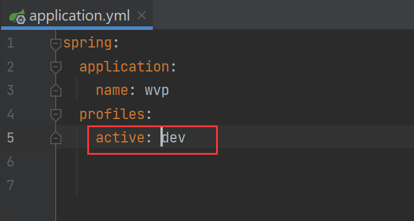  
后续的相关配置改动可以在application-dev.yml中进行改动
****  


### 5、准备数据库
#### 5.1 mysql安装与配置
安装mysql的教程在网上大把，随便一个都行   
1、新建mysql数据库：
  ```text
  1)首先新建一个mysql数据库，设置好数据库名以及用户名和密码
  2）运行 “\wvp-GB28181-pro\sql\初始化.sql”，创建好数据库
  ```  

2、在yml文件中进行mysql数据库的设置：
  ```text
  spring:
    datasource:
        type: com.zaxxer.hikari.HikariDataSource
        driver-class-name: com.mysql.cj.jdbc.Driver
        # 下面的数据库名称换成上一步设置的
        url: jdbc:mysql://127.0.0.1:3306/wvp?useUnicode=true&characterEncoding=UTF8&rewriteBatchedStatements=true&serverTimezone=PRC&useSSL=false&allowMultiQueries=true&allowPublicKeyRetrieval=true
        
        # 下面的用户名和密码换成自己设置的
        username: root
        password: 12345678
  
  mybatis:
    configuration:
      map-underscore-to-camel-case: true
  ```   
****     

#### 5.2 配置redis数据库（网上开启redis服务方法很多种，以下介绍一种）：  
1、打开redis安装目录，并在该目录中打开命令行，在命令行中输入；redis-server  
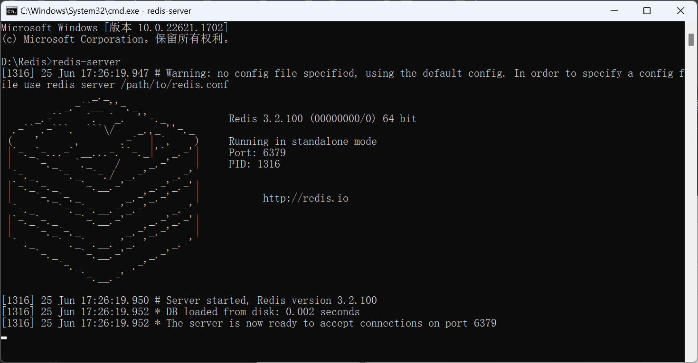  
2、双击**redis-cli.exe**即可开启redis服务。
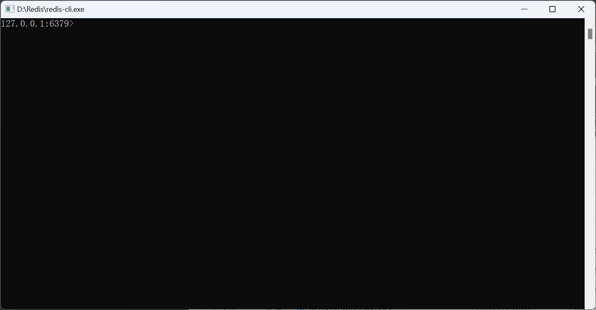   
3、在yml文件中配置redis：
  ```text
  spring: 
    redis:
        # [必须修改] Redis服务器IP, REDIS安装在本机的,使用127.0.0.1
        host: 127.0.0.1
        # [必须修改] 端口号
        port: 6379
        # [可选] 数据库 DB
        database: 6
        # [可选] 访问密码,若你的redis服务器没有设置密码，就不需要用密码去连接
        password: ""
        # [可选] 超时时间
        timeout: 10000
  ```   
*****


#### 5.3 配置服务启动端口（可直接使用默认配置）
```text
# [可选] WVP监听的HTTP端口, 网页和接口调用都是这个端口
server:
    port: 18080
```   
****

#### 5.4 配置28181相关信息（可直接使用默认配置）
1、下面配置中“[必须修改]”的是需要根据自己主机进行修改

```text
# 作为28181服务器的配置
sip:
    # [必须修改] 本机的IP
    ip: 192.168.1.3
    # [可选] 28181服务监听的端口
    port: 5060
    # 根据国标6.1.2中规定，domain宜采用ID统一编码的前十位编码。国标附录D中定义前8位为中心编码（由省级、市级、区级、基层编号组成，参照GB/T 2260-2007）
    # 后两位为行业编码，定义参照附录D.3
    # 3701020049标识山东济南历下区 信息行业接入
    # [可选]
    domain: 3402000000
    # [可选]
    id: 34020000002000000001
    # [可选] 默认设备认证密码，后续扩展使用设备单独密码, 移除密码将不进行校验
    password: 12345678
```
**Remark** **!!!!!**:
- 本机IP修改：
  - 打开命令行，输入*ipconfig*，其中该项后面就是本机IP，需要在yml文件中修改
  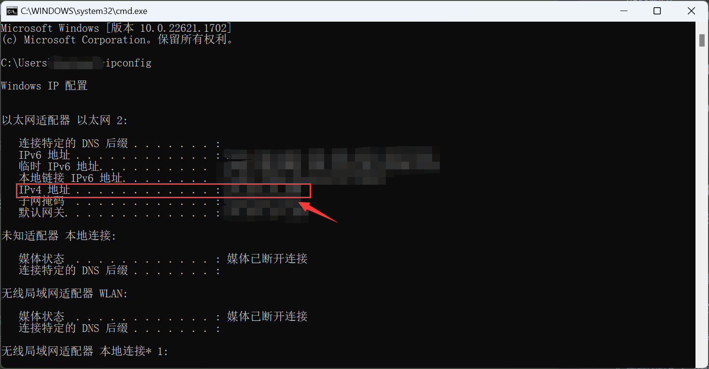
- “[可选]”的可以直接使用*默认配置*  
******

#### 5.5 **配置ZLMediaKit连接信息**(有坑！！！)
先看看官方文档的配置：
```text
#zlm 默认服务器配置
media:
    # ZLMediaKit的服务ID，必须配置
    id: FQ3TF8yT83wh5Wvz
    
    # [必须修改] zlm服务器的内网IP，sdp-ip与stream-ip使用默认值的情况下，这里不要使用127.0.0.1/0.0.0.0
    ip: 192.168.1.3
    
    # [必须修改] zlm服务器的http.port
    http-port: 6080
    
    # [可选] zlm服务器的hook.admin_params=secret
    secret: 035c73f7-bb6b-4889-a715-d9eb2d1925cc
    # 启用多端口模式, 多端口模式使用端口区分每路流，兼容性更好。 单端口使用流的ssrc区分， 点播超时建议使用多端口测试
    rtp:
        # [可选] 是否启用多端口模式, 开启后会在portRange范围内选择端口用于媒体流传输
        enable: true
        # [可选] 在此范围内选择端口用于媒体流传输,
        port-range: 30000,30500 # 端口范围
        # [可选] 国标级联在此范围内选择端口发送媒体流,
        send-port-range: 30000,30500 # 端口范围
    # 录像辅助服务， 部署此服务可以实现zlm录像的管理与下载， 0 表示不使用
    record-assist-port: 18081
```
**Remark** **!!!**（   *主要有三个必须要修改的地方*     ）：  
- ZLMediakit的服务ID是什么：
  - 打开ZLMediakit文件夹中```release/windows/Debug```文件夹下的config.ini配置文件，找到```mediaServerId```这一项，在官方文档中说是**换成该项的Id值**，不过在第一次编译完zlmediakit的时候，```mediaServerId```
这一项是显示的```your_server_id```（如下图所示），需要删除config.ini配置文件，重新运行以下MediaServer，就会重新生成一个新的配置文件，该文件里面就会随机生成一个新的```server_id```。
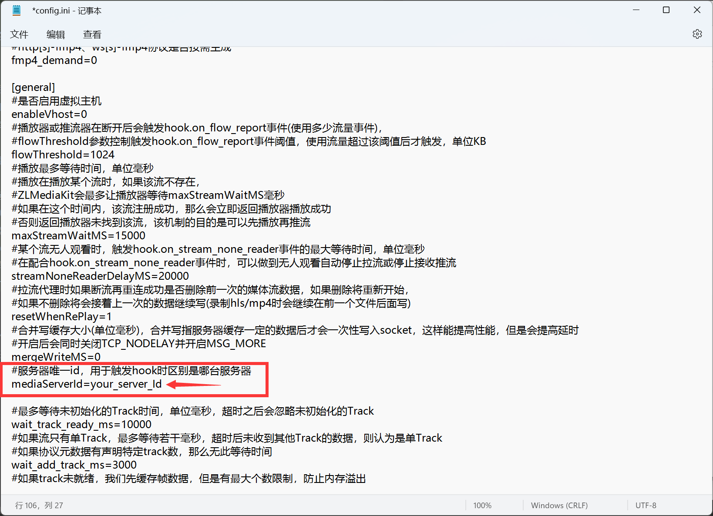  

- ZLM服务器的内网IP是什么：
  - 打开命令行，输入```ipconfig```，查看该项就是**内网IP**，将内网IP进行更改。
    

- ZLM服务器的http.port是什么：
  - 打开ZLMediakit文件夹中```release/windows/Debug```文件夹下的config.ini配置文件，找到该项即可，并将yml文件中的相对应port更改
  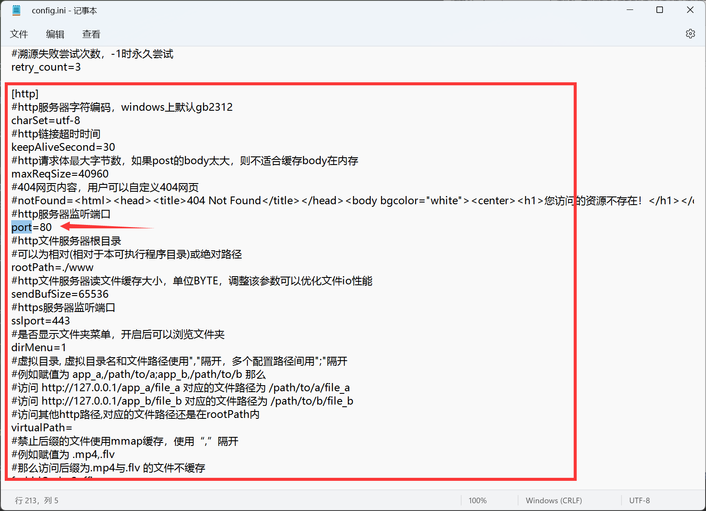
********
  
#### 5.6 个性化信息配置（可直接使用默认配置）
```text
# [根据业务需求配置]
user-settings:
    # [可选] 服务ID，不写则为000000
    server-id:
    # [可选] 自动点播， 使用固定流地址进行播放时，如果未点播则自动进行点播, 需要rtp.enable=true
    auto-apply-play: false
    # [可选] 部分设备需要扩展SDP，需要打开此设置
    senior-sdp: false
    # 保存移动位置历史轨迹：true:保留历史数据，false:仅保留最后的位置(默认)
    save-position-history: false
    # 点播等待超时时间,单位：毫秒
    play-timeout: 3000
    # 等待音视频编码信息再返回， true： 可以根据编码选择合适的播放器，false： 可以更快点播
    wait-track: false
    # 是否开启接口鉴权
    interface-authentication: true
    # 自动配置redis 可以过期事件
    redis-config: true
    # 接口鉴权例外的接口, 即不进行接口鉴权的接口,尽量详细书写，尽量不用/**，至少两级目录
    interface-authentication-excludes:
        - /api/v1/**
    # 推流直播是否录制
    record-push-live: true
    # 国标是否录制
    record-sip: true
    # 是否将日志存储进数据库
    logInDatebase: true
    # 第三方匹配，用于从stream钟获取有效信息
    thirdPartyGBIdReg: [\s\S]*
```
*****


#### 5.7 启动WVP 
至此为止wvp就配置好了，下面就可以启动了，
- 首先启动ZLM，在之前步骤有提到过如何启动zlm；
- 接着启动wvp即可，当然想要打开前端界面的话，可以按照以下步骤：
  - 打开wvp文件夹下的```\websrc```目录，在该目录下打开cmd，输入```npm run dev```即可。
  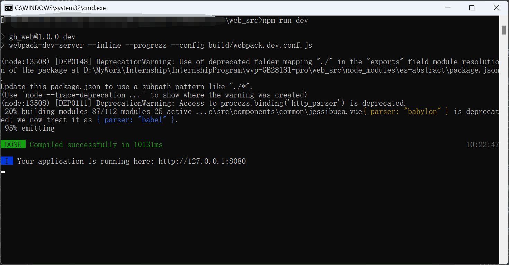
  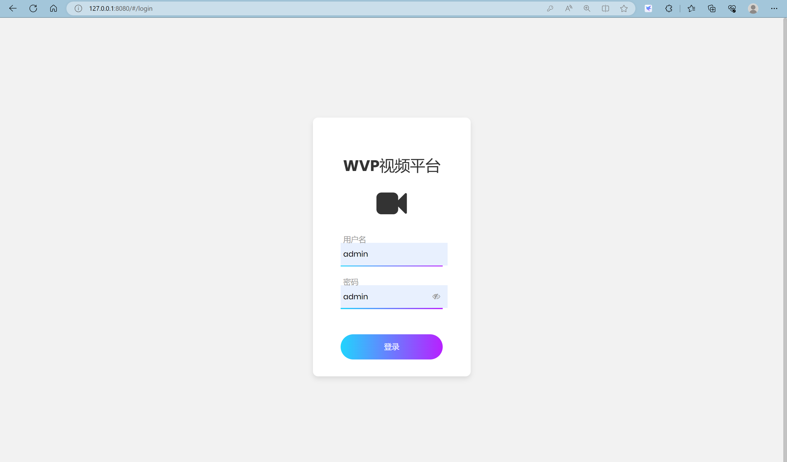


## 三、集成YOLO功能
***
### 1、YOLO后端
```text
Yolo的后端代码是基于python，利用了flask框架进行整合，代码在yolo_backend文件夹中。
```
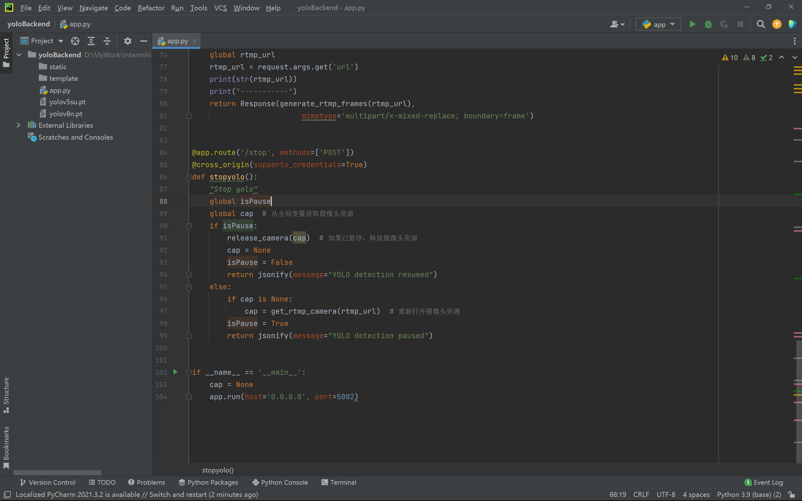
***


### 2、YOLO前端
```text
Yolo的前端代码在wvp-GB28181-pro文件夹下的web_src文件夹中
```
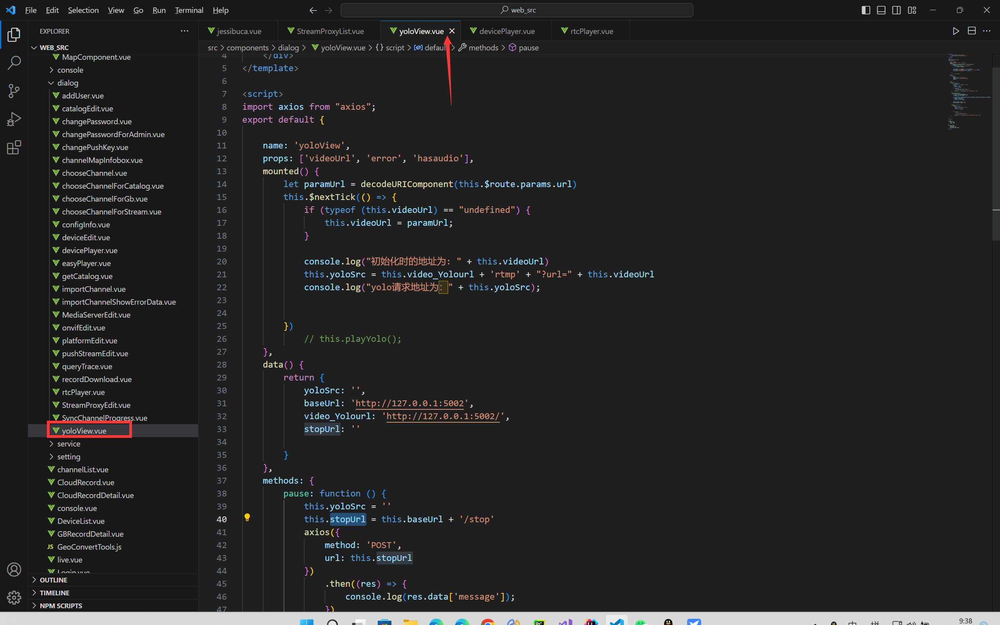
***

### 3、Yolo效果
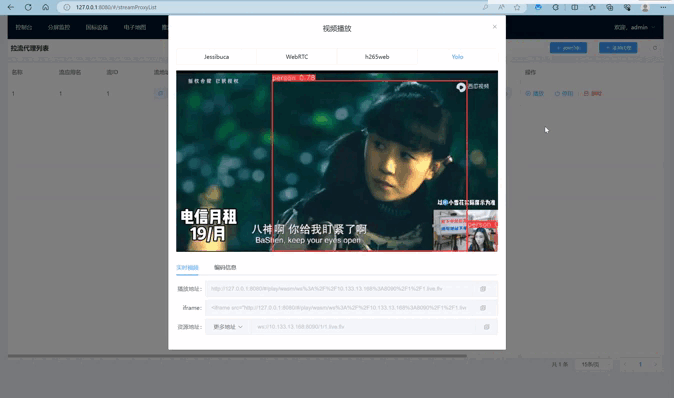

  

